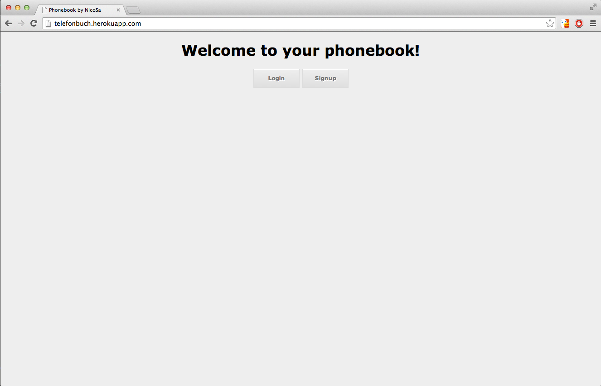

Welcome to my Phonebook app
===
This is an app I was fiddling around with before starting at Makers Academy.


Heroku
----
[App on Heroku]

Objectives of exercise
----
Playing around to get to grips with how view, models and controllers work together. Having fun and learning at the same time.

Technologies used
----
- Ruby
- Sinatra
- Javascript
- HTML5
- CSS3
- Git
- Heroku
- MongoDB

How to run it
----
```sh
git clone https://github.com/NicoSa/Phonebook
cd phonebook
start.sh
```
[App on Heroku]:http://telefonbuch.heroku.com
